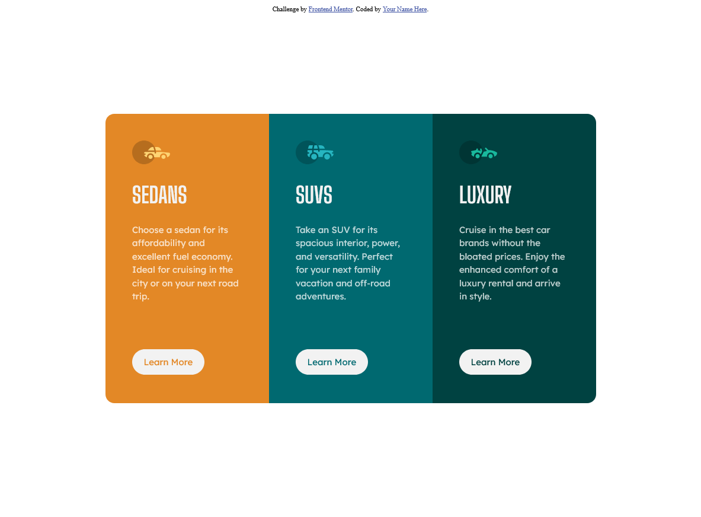

# Frontend Mentor - 3-column preview card component solution

This is a solution to the [3-column preview card component challenge on Frontend Mentor](https://www.frontendmentor.io/challenges/3column-preview-card-component-pH92eAR2-). Frontend Mentor challenges help you improve your coding skills by building realistic projects. 

## Table of contents

- [Overview](#overview)
  - [The challenge](#the-challenge)
  - [Screenshot](#screenshot)
  - [Links](#links)
- [My process](#my-process)
  - [Built with](#built-with)
  - [What I learned](#what-i-learned)
  - [Continued development](#continued-development)
  - [Useful resources](#useful-resources)
- [Author](#author)


## Overview

### The challenge

Users should be able to:

- View the optimal layout depending on their device's screen size
- See hover states for interactive elements

### Screenshot



### Links

- Solution URL: [GitHub Repo](https://github.com/BrigitteSprung/3-column-preview-card-component-frontendmentor/)
- Live Site URL: [GitHub Pages](https://brigittesprung.github.io/3-column-preview-card-component-frontendmentor/)

## My process

1. Create the repo
2. Create the html structure
3. Add classes to everything
4. Center everything and make the display flex
5. Add all the styling - colours and font
6. Play with padding and margins
7. Add hover state
8. Add tablet and mobile media queries

### Built with

- Semantic HTML5 markup
- CSS custom properties
- Flexbox
- CSS Grid

### What I learned

This is the second Frontend Mentor project I've done and it went a lot better. I went in with a better than and structure and it showed. The flex-wrap property was magic to get everything responsive. 

I also found better code to center the main div, see below:

```css
.card {
  /* magic centered */
    position: absolute;
    left: 50%;
    top: 50%;
    transform: translate(-50%, -50%);
}
```

### Continued development

I am quite happy with this project. I might want to touch up small issues like padding, margins and text size. But otherwise I am happy with how this turned out. I am keen to try all the beginner projects and get css practice in.


### Useful resources

- [Resource 1](https://blog.hubspot.com/website/center-div-css) - This helped me find the centered div code
- [Resource 2](https://codepen.io/brigittesprung/pen/MWpvNPr?editors=0100) - This is a previous project of mine that I referred to with regards to flex-wrap.

## Author

- Website - [Brigitte Sprung](https://brigittesprung.github.io)
- Frontend Mentor - [@BrigitteSprung](https://www.frontendmentor.io/profile/brigittesprung)
- LinkedIn - [Brigitte Sprung](https://www.linkedin.com/in/brigittesprung/)
